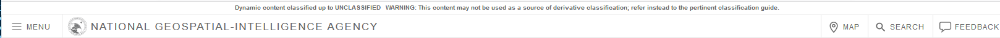

# NGA Styleguide

NGA's official web styleguide can be found here -> [NGA CDN Homepage](http://cdn.nga.mil/)

- - - -

## Index

1.  [Color Scheme](#color-scheme)
1.  [The Ecobar](#the-ecobar)
  1.  [Introducing the Ecobar](#introducing-the-ecobar)
  1.  [Ecobar Configuration](#ecobar-configuration)
1.  [Bootstrap](#bootstrap)
1.  [react-bootstrap](#react-bootstrap)

- - - -
- - - -

## Color Scheme

- [NGA CDN Color Scheme Documentation](http://cdn.nga.mil/#/colors)

- [NGA CDN CSS Color Picker](http://cdn.nga.mil/#/colorpicker)

| Color        | Hex           |
| :----------- | ------------: |
| Blue         | `#154e7d`     |
| Light Blue   | `#80c3d4`     |
| Teal         | `#32a6ad`     |
| Green        | `#0d9346`     |
| Light Green  | `#8cc640`     |
| Grey         | `#4f4f4f`     |

- - - -
- - - -

## The Ecobar



- - - - 

*( ^ ^ The NGA CDN Ecobar )*

 - Here's the [NGA CDN Ecobar Documentation](http://cdn.nga.mil/#/ecobar), for all of the specifics.

### Introducing the Ecobar

Add the CDN Ecobar script to your `index.html` file, like so:

```html
<!DOCTYPE html>
<html lang="en">
  <head>
    <meta charset="utf-8">
    <title>TDGI React Template</title>

    <!-- You have to load jquery before the ecobar -->
    <script type="text/javascript" src="https://cdn.nga.mil/libs/jQuery/versions/1.12.4/jquery.js"></script>

    <!-- NGA Ecobar -->
	<script type="text/javascript" src="https://cdn.nga.mil/libs/ecobar/versions/2.0.0/ecobar.js"></script>

    <!-- Latest compiled and minified CSS -->
    <link rel="stylesheet" href="https://cdn.nga.mil/libs/Bootstrap/versions/3.3.6/bootstrap.min.css">

    <!-- Optional theme -->
    <link rel="stylesheet" href="https://cdn.nga.mil/app/css/styles.min.css">

  </head>
  <body>
		<script type="text/javascript">
		    // build the default Ecobar
        var config = {
          app_id: "appxux0010101",
          //your project name goes here
          branding: "TDGI React Template",
          profile: {
            show: false
          }
        };
			  var eco = xdi.ecobar(config);
		</script>
    <noscript>
      You need to enable JavaScript to run this app.
    </noscript>
    // this sticks the ecobar's footer
    // to the bottom of the page by setting
    // the min-height of your application
    // to the viewport height minus the
    // combined size of the ecobar and footer.
    <div id="root" style="min-height: calc(100vh - 233px);"></div>
  </body>
</html>

```

> :exclamation: Please note this little snippet right here:

```html
// this sticks the ecobar's footer
// to the bottom of the page by setting
// the min-height of your application
// to the viewport height minus the
// combined size of the ecobar and footer.
<div id="root" style="min-height: calc(100vh - 233px);"></div>
```

> is important because the ecobar will 'float' around the middle of the page if you don't have enough content to 'push' it to the bottom.  It just looks bad.


> *(^^ We don't want this thing flying around all crazy-like.)*

### Ecobar Configuration

The [NGA CDN Ecobar Documentation](http://cdn.nga.mil/#/ecobar) covers the configuration options pretty well, so I'll just copypasta the full configuration object here for reference:

```javascript
var config = {
  app_id: 'appxux0010101',
  branding: 'NGA App',
  classification:'U//FOUO', // if set, this
  // will override the classification
  //text on the top an bottom banners
  footer:false, // defaults to show footer
  search:{
    url:'http://mysearch.com/search?q=',
    title:'Appy Search'
  }
  profile:{ // can provide any or all, or none
    firstName:'John', lastName:'Smith',
    security:'Unclassified',
    url:'/path/to/profile/form.html'
  },
  feedback: {
    url:'/path/to/feedback/form.html',
  }
}
```

> :exclamation: *(Note that you can turn the footer off by setting footer to `false`.)*


- - - -
- - - -

## Bootstrap

[NGA's CDN Bootstrap Documentation](http://cdn.nga.mil/#/Bootstrap) has the whole 'Introducing Bootstrap' part of this documentation covered.

The [Bootstrap Official Documenttion](http://getbootstrap.com/docs/4.0/components/alerts/) is a great reference for using bootstrap components and classes.  

- - - -
- - - -

## react-bootstrap

[react-bootstrap](https://react-bootstrap.github.io/introduction.html) "is a library of reusable front-end components. You'll get the look-and-feel of Twitter Bootstrap, but with much cleaner code, via Facebook's React.js framework."

> :exclamation:*react-bootstrap is still under active development.  They have not yet released v1.0.0.*

react-bootstrap provides a very clean way to implement common bootstrap coponents in a react-app.  It doesn't much affect the components appearance of behavior in production, but it does make the codebase cleaner and easier to maintain.  Because react-bootstrap does not yet have a stable release, using it is completely optional.

- - - -
- - - -
